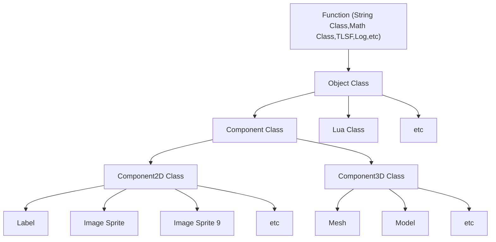

## Object Base Class

-----


[toc]




```c++
class Object 
{
public:
	Object(int autorelease = 1);
	virtual ~Object();
public:
	YOSEFSInt32 mReferenceCount;
	int mLuaData;
	int mObjectMask;
public:
	void retain();
	void release();
};
```

