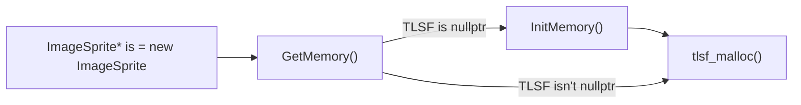
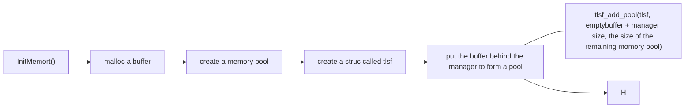

- [Main Thread](#main-thread)
- [Why we need memory pool](#why-we-need-memory-pool)
- [[TLSF(Two-Level Segregated Fit)](https://github.com/mattconte/tlsf)](#-tlsf-two-level-segregated-fit---https---githubcom-mattconte-tlsf-)
  * [Abstract](#abstract)
  * [Introduction](#introduction)
  * [Real-Time Requirements for DSA](#real-time-requirements-for-dsa)
  * [Fragmentation](#fragmentation)
  * [DSA Algorithms](#dsa-algorithms)
  * [DSA Operational Model](#dsa-operational-model)
  * [TLSF Data Structures](#tlsf-data-structures)
  * [内存对齐](#----)
- [Code Analysis](#code-analysis)
  * [Initialize the TLSF structure](#initialize-the-tlsf-structure)
- [How to use](#how-to-use)
- [How working in the YosefEngine](#how-working-in-the-yosefengine)

### Main Thread

```c++
//in my engine only main thread memory
while(1) --> main thread
{
    1. update();
    2. render();
}
```


### Why we need memory pool

考虑一个问题：如果系统内存128GB， 内存池200MB，如果需要一个地址空间来放数据。从哪里获取更方便。

在程序启动后，内存池会从系统那这里获取一个固定大小的内存块，以后所有应用程序的内存都从这个内存块里分配。此外，还可以屏蔽系统差异带了的应用程序的表现差异。


### [TLSF(Two-Level Segregated Fit)](https://github.com/mattconte/tlsf)

对于实时的系统，对worst case 有要求

1. 最坏情况应该可估计  O(1) cost for malloc, free, re-malloc, memory-malign
2. 稳定 -》采用相同的策略去分配内存
3. 内存碎片小

Next is my reading note of a [paper](http://www.gii.upv.es/tlsf/files/ecrts04_tlsf.pdf)

#### Abstract

The use of DSA has been considered a source of indeterminism in the real-time domain, due to the unconstrained response time of DSA algorithms and the fragmentation problem.

New real-time applications require more flexibility: the ability to adjust system configuration in response to workload changes and application reconfiguration.

#### Introduction

In real-time systems, it is needed to know in advance the operation time bounds in order to analyze the system schedulability.

TLSF, for dynamic memory allocation that presents a bounded worst-case response time, while keeping the efficiency of the allocation and deallocation operations with a temporal cost of O(1). A small and bounded fragmentation is also achieved by the TLSF.

#### Real-Time Requirements for DSA

Most non-real-time applications take only a few minutes or hours to complete their work and finalize. Real-time applications are usually executed continuously during the whole life of the system, which leads to memory fragmentation problems.

- Bounded response time
- Fast response time
- Memory requests need to be always satisfied

#### Fragmentation

Memory exhaustion may occur due to two reasons:

- The application requires more memory that the total memory available in the system
- The DSA is unable to reuse memory that is free,
  - internal frag
  - external frag

#### DSA Algorithms

- Sequential Fit
- Segregated Free Lists
- Buddy Systems
- Indexed Fit
- Bitmap Fit

#### DSA Operational Model

A DSA is an abstract data type that keeps track of which blocks of memory are in use and which are free. 

- Insert a free block
- Search for  a free block of a given size or larger
- Search for a block adjacent to another
- Remove a free block

#### TLSF Data Structures

The basic segregated fit mechanism uses an array of free lists, with each array holding free blocks within a size class.

- The first-level array divides free blocks into classes that are a power of two apart (16, 32, 64, 128, etc.)
- The second-level sub-divides each first-level class linearly

The TLSF embeds into each block the information needed to manage the block (whether the block is free or not) and the pointers to link it into the two lists: the list of blocks of similar sizes and the list ordered by physical addresses.

Most TLSF operations rely on the segregate list() mapping function. Given the size of a block, the mapping function calculates the indexes of the two arrays that point to the corresponding segregated list that holds the requested block.
$$
mapping(size)→(f,s)
$$

$$
mapping(size) = \left\{
\begin{aligned}
f:= \lfloor log_2(size)\rfloor \\
s:= (size-2^f)\frac{2^{SLI}}{2^f}
\end{aligned}
\right.
$$

- Initialize TLSF structure
- Destroy TLSF structure
- Get a free block
- First step
- Second step
- Insert a free block
- Coalesce blocks


#### 内存对齐

```c++
size_t alloc_memory_size = (size + (align - 1)) & ~(align - 1);
```


### Code Analysis

in the Runtime/Allocator

- tlsf
- DefaultAllocator.cpp 
- DefaultAllocator.h
- MemoryLabel.h

#### Initialize the TLSF structure

```c++
tlsf_t tlsf_create_with_pool(void* mem, size_t bytes)
{
    tlsf_t tlsf = tlsf_create(mem);
	tlsf_add_pool(tlsf, (char*)mem + tlsf_size(), bytes - tlsf_size());
	return tlsf;
}

void InitMemory()
{
    void* buffer = malloc(mReservedSize);
	sTLSF = tlsf_create_with_pool(buffer, mReservedSize);
}

void* GetMemorty(size_t size)
{
    if(sTLSF == nullptr)
        InitMemory();
    return tlsf_malloc(sTLSF, size);
}

void* operator new(std::size_t size)
{
    void* ptr = GetMemorty(size);
    return ptr;
}
```





```c++
pool_t tlsf_add_pool(tlsf_t tlsf, void* mem, size_t bytes)
{
	block_header_t* block;
	block_header_t* next;

    /*
    ** Overhead of the TLSF structures in a given memory block passes to
    ** tlsf_add_pool, equal to the overhead of a free block and the
    ** sentinel block.
    */
	const size_t pool_overhead = tlsf_pool_overhead();
	const size_t pool_bytes = align_down(bytes - pool_overhead, ALIGN_SIZE);

	if (((ptrdiff_t)mem % ALIGN_SIZE) != 0)
	{
		printf("tlsf_add_pool: Memory must be aligned by %u bytes.\n",
			(unsigned int)ALIGN_SIZE);
		return 0;
	}

	if (pool_bytes < block_size_min || pool_bytes > block_size_max)
	{
#if defined (TLSF_64BIT)
		printf("tlsf_add_pool: Memory size must be between 0x%x and 0x%x00 bytes.\n", 
			(unsigned int)(pool_overhead + block_size_min),
			(unsigned int)((pool_overhead + block_size_max) / 256));
#else
		printf("tlsf_add_pool: Memory size must be between %u and %u bytes.\n", 
			(unsigned int)(pool_overhead + block_size_min),
			(unsigned int)(pool_overhead + block_size_max));
#endif
		return 0;
	}

	/*
	** Create the main free block. Offset the start of the block slightly
	** so that the prev_phys_block field falls outside of the pool -
	** it will never be used.
	*/
	block = offset_to_block(mem, -(tlsfptr_t)block_header_overhead);
	block_set_size(block, pool_bytes);
	block_set_free(block);
	block_set_prev_used(block);
	block_insert(tlsf_cast(control_t*, tlsf), block);

	/* Split the block to create a zero-size sentinel block. */
	next = block_link_next(block);
	block_set_size(next, 0);
	block_set_used(next);
	block_set_prev_free(next);

	return mem;
}
```

### How to use

In the Test/MemoryPool

- The basic operation of TLSF

- new object on the specified memory block

  - ```c++
    A* a = new (ptr)A;
    ```

  - ```c
    A* a = new A;
    ```

- add label information to memory


### How working in the YosefEngine

In Runtime/Allocator/DefaultAllocator
