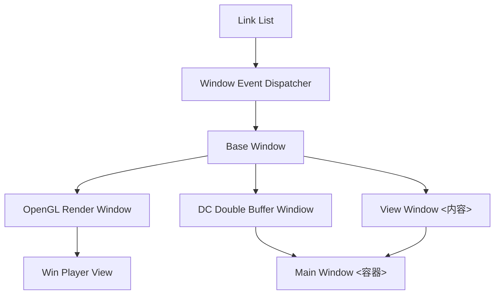

## 窗口的派生逻辑

最底层 - 功能层 保证功能互相不依赖

```mermaid
graph TD
A[Link List] --> B[Window Event Dispatcher] --> C[Base Window]
C --> D[OpenGL Render Window] --> F[Win Player View]
C --> E[DC Double Buffer Windiow] --> G[Main Window <容器>]
C --> H[View Window <内容>] --> G
```

### Base Window

