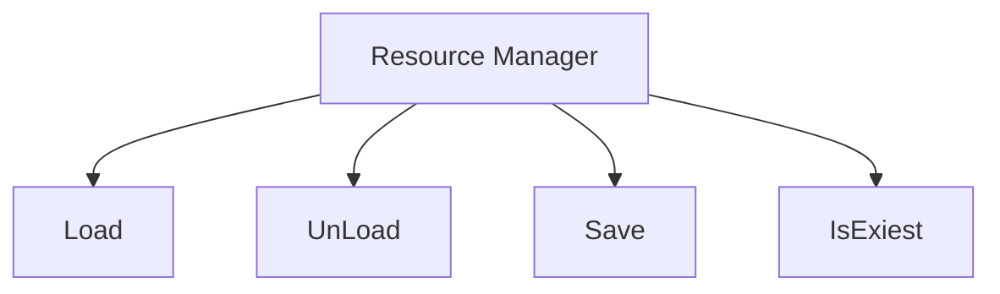

## 资源管理器




```C++
bool LoadData(const char* path, Data& data, FixedString* realPath = nullptr);

bool LoadData(const char* path, Data& data, FixedString* realPath)
{
    if(LoadDataFromRuntimeDataPath(path, data, realPath))
        return true;
    
    if(LoadDataFromBuiltinDatapath(path, data, realPatj))
        return true;
    
    if(LoadDataFromPath(pat, data))
    {
        if(realPath != nullptr)
            (*realPath) = path;
        return true;
    }
    
}
```

```c++
bool LoadDataFromRuntimeDataPath(const char* path, Data& data, FixedString* realPath)
{
    const char* guid = GetGUIDViaName(path);
    const char* target = guuiid == nullptr ? path : guid;
    if(LoadOuterData(target, data))
    {
        if（realPath != nullptr)
            (*realPath) = target;
        return true;
    }
    return false;
}
```

```c++
bool LoadDataFromBuiltinDatapath(const char* path, Data& dat, FixedString *realPath)
{
    const char* guid = GetGUIDViaName(path);
  	const char* target = guuiid == nullptr ? path : guid;
    if(LoadInternalData(target, data))
    {
        if(realPath != nullptr)
        {
            (*realPath) = target;
        }
        return true;
    }
    return false;
}
```

