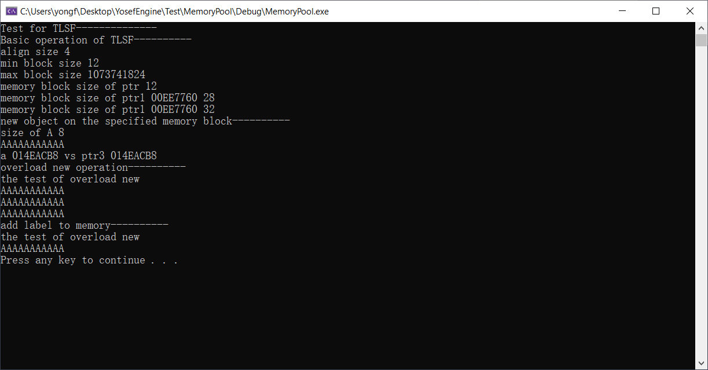
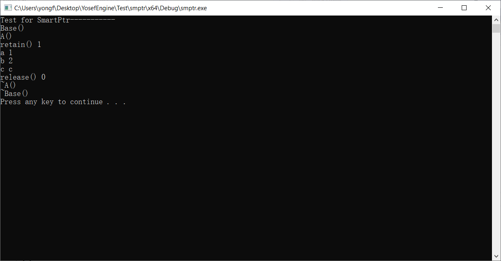
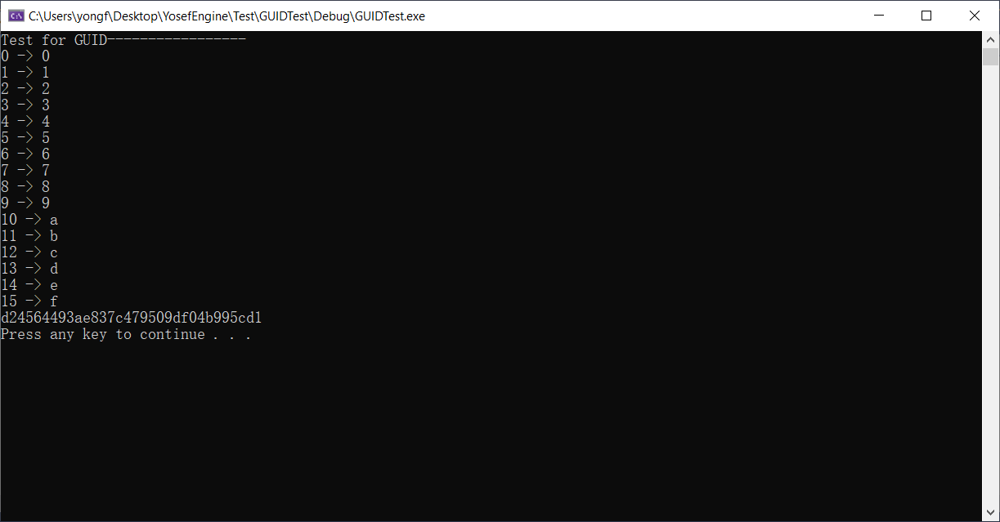
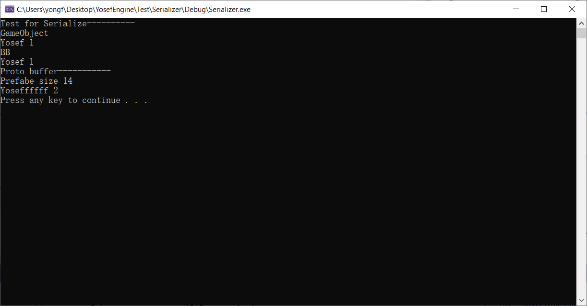
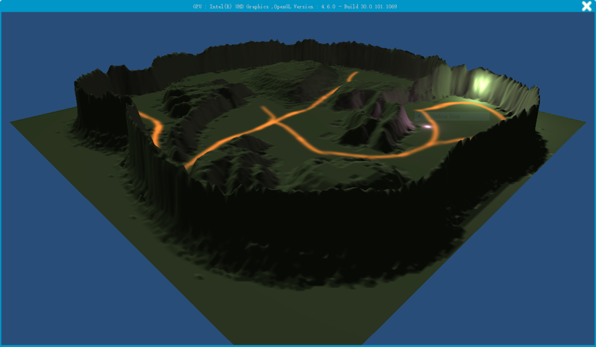

#### 2022.1.1 

-----
1. Imported [Third-Party libraries](./NOTE/ThirdLib.md)
2. The entry function has been created -> Entry/main.cpp (extern c -->YosefGo)
3. RuntimePfefix.h (TODO: Add adaptations to other operating systems）
4. Utils/ LinkedList.h(Added single linked list and two-way linked list)
5. Added Log.h / Log.cpp
6. Added Msg handing function

[Windows](./NOTE/Windows端.md) [Derived logic of window](./NOTE/窗口的派生逻辑.md) 

#### 2022.1.13

---

1. Read paper
1. Added TLSF
2. Added memory pool
2. Added test for memory pool

[memory pool](./NOTE/内存池管理.md) 

#### 2022. 1. 20

----

- Added Object Base Class
- Added my Smart Ptr Class

- Added my StringUtils Class
- Added GUID
- Added some Control
  - Button Control
  - Image Control
  - Text Control

[Object Base Class](./NOTE/Object基类.md)  [Smart Ptr Class](./NOTE/智能指针.md)  [GUID](./NOTE/GUID.md) 

#### 2022. 2. 10

----

- Added OpenGL Debugger
- Updated statistics.pl
- Added Plugin in Runtime/Plugins
  - Fixed 
    - _CRT_NONSTDC_NO_DEPRECATE
    - _CRT_SECURE_NO_WARNINGS
- Added my Fixed String Class
- Added Timer
- Added Socket Utils
- Added Image Decoder Utils

#### 2022. 2. 17

----

- Added Serialization （use Protobuf)

  - Animation
  - Assets
  - Audio
  - Avatar
  - Camera
  - Color
  - GameObject
  - GLSL
  - ImageSprite
  - Label
  - Material
  - Mesh
  - Particle
  - Physics
  - Scripts
  - TetureAltas
  - TextureInfo
  - Vector
  - WindowsPlayer
  
  [Serialize](./NOTE/序列化以及反序列化的方案.md)
  
  
  
   

#### Result

